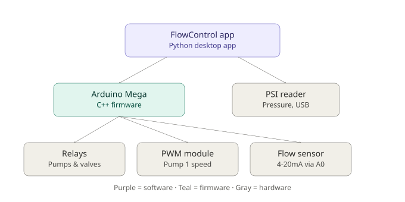
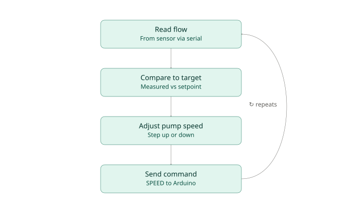

# FlowControl


Automated control and monitoring system for a cross-flow water filtration
membrane test rig, built for a chemical and environmental engineering lab
studying water filtration and contamination across the Pacific Northwest.

<p align="center">
  
</p>

## Background

The lab's filtration research depended on holding a steady permeate flow rate
for hours at a time. Before this project, that meant someone manually
watching the pump and adjusting it by hand for the full duration of every
trial. The lab needed a system that could read flow live, hold a target
rate automatically, and free up researcher time.

I took this on solo: reviewed the lab's project brief and system diagrams,
then designed and built the full stack, from relay wiring to the desktop app
researchers use today.

## What it does

- Reads live flow rate from an inline flow sensor
- Automatically adjusts peristaltic pump speed to hold a target flow rate
- Runs automatic timed backwash cycles between filtration runs
- Live flow-vs-time and pressure-vs-time graphs
- CSV logging for every trial
- Simple one-screen interface so lab members don't need to touch code

## Hardware

| Component | Role |
|---|---|
| Arduino Mega 2560 | Central controller |
| Relay board (x4) | Pump 1 on/off, backwash pump on/off, Valve 1, Valve 2 |
| PWM-to-0-10V module | Pump 1 speed control |
| Peristaltic pump | Filtration pump, speed-controlled |
| Backwash pump | On/off only |
| Inline ultrasonic flow sensor | Live flow measurement |
| USB pressure reader | Live PSI measurement |

I brainstormed the control architecture from the lab's diagrams, ordered the
relays and PWM module, then brought each piece up one at a time against the
Arduino firmware before wiring the full system together. Figuring out which
pump wires controlled speed versus on/off took a fair amount of multimeter
work to trace correctly before the wiring was final.

## Firmware (C++)

Arduino firmware handles:
- Relay control for both pumps and both valves
- PWM output to the 0-10V module for pump speed
- Sampling the flow sensor's analog output and converting it to a flow rate
- Streaming live status (pump state, valve state, flow) over serial every
  second, and responding to commands from the Python app

## Control App (Python)

A Tkinter desktop app that:
- Reads live serial data from the Arduino
- Plots real-time flow and pressure graphs
- Runs the closed-loop correction logic: compares measured flow to the
  target and adjusts pump speed automatically
- Handles automatic filtration/backwash cycling
- Logs every trial to CSV
- Keeps calibration and tuning settings in a saved config file so trials are
  repeatable without re-entering values

The interface was kept deliberately simple: a researcher sets a target flow
rate and presses Start. Everything else runs on its own.

<p align="center">
  
</p>

## Sensor interface change

The original flow sensor's digital interface (RS-485) never returned a
response during bring-up, across every baud rate, parity setting, and both
its supported protocols. Bench measurements with a multimeter confirmed the
wiring and signal lines were sound, which pointed to the sensor's serial
interface being vendor-locked, requiring the manufacturer's own configuration
software to enable rather than a wiring fault.

After ruling out the wiring, we replaced it with an I2C flow sensor
(Sensirion SLF3S-1300F) that ships with an open driver library, wired
directly to the Arduino's I2C bus. This removed the vendor dependency and
let the sensor integration move forward without waiting on the original
manufacturer.

## Status

The system is built, wired, and running the full control loop end to end.
The lab has begun using it to run filtration trials.

## Repo layout

```
FlowControlApp/
  FlowControl.exe
  config.json
  Arduino_Firmware/
    flow_control_arduino_firmware.ino
  Source_Code/
    flow_control_gui.py
    requirements.txt
```
